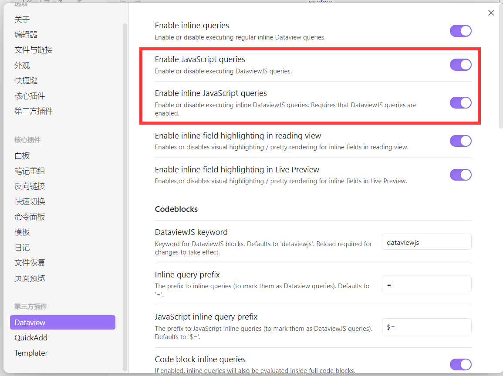
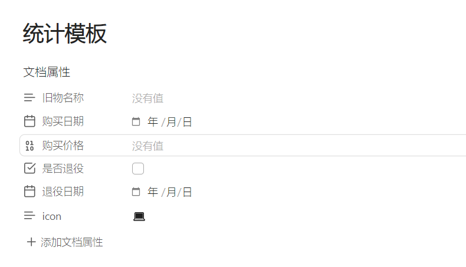
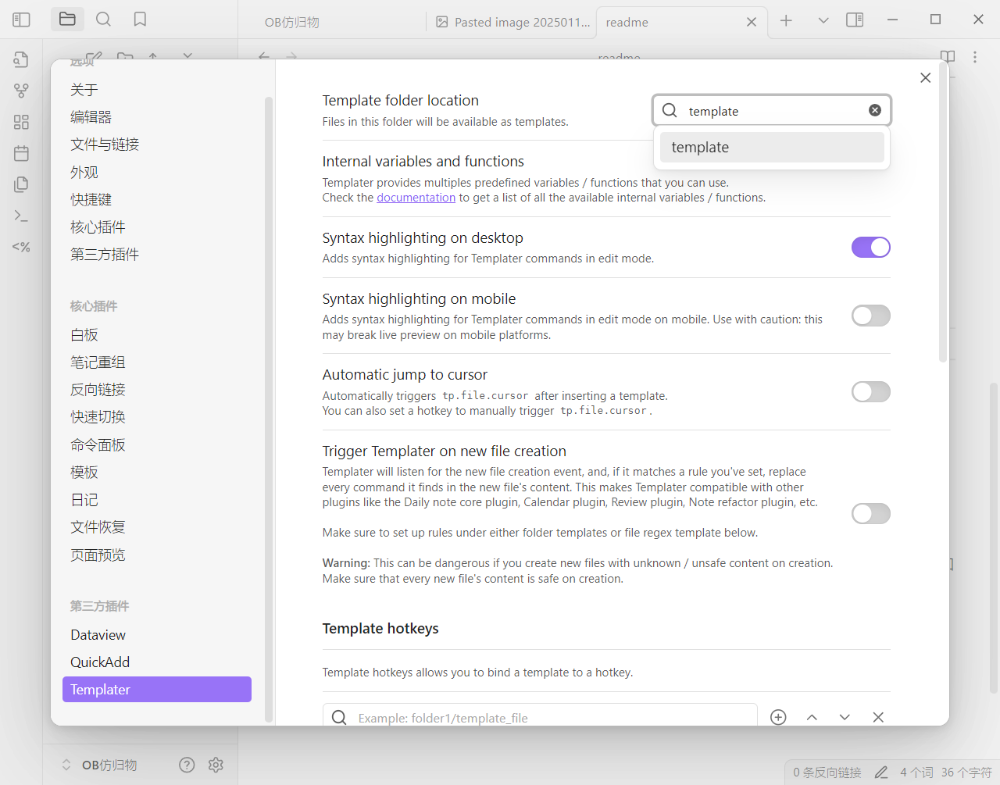
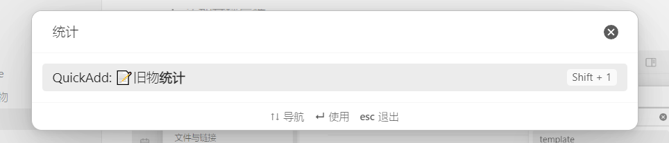
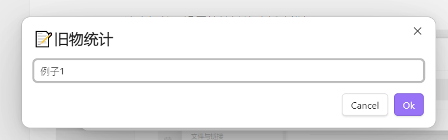
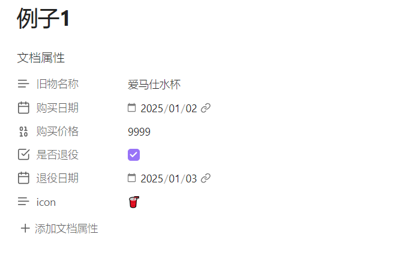
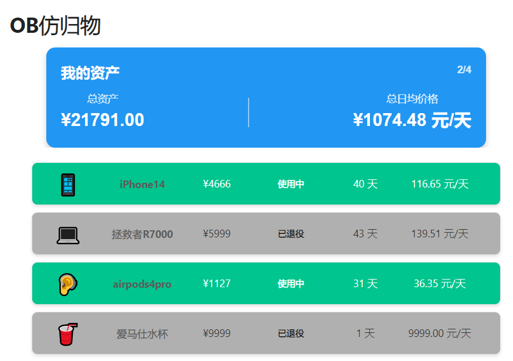

# obsidian-旧物统计萌新手册
使用OB进行旧物统计，界面设计来源于归物APP
具体操作手册见readme.md

主要是用dataview中的HTML用法实现。我尝试用DV.TABLE进行动态样式渲染，但是失败了。因为我也是初学者，只能撰写简单的逻辑和样式，仅供参考。希望各位大佬有改进方案的可以和我讨论！

1.下载三个插件，其中dataview记得开起来JS

2.设置统计模板，里面的字段可以根据自己的需求添加修改。记得在插件里设定模板存储位置

3.用quickadd这个插件，设置快捷键快速新建模板

4.设置自己的物品，就可以返回界面查看到了

完结撒花🎉🎉🎉

